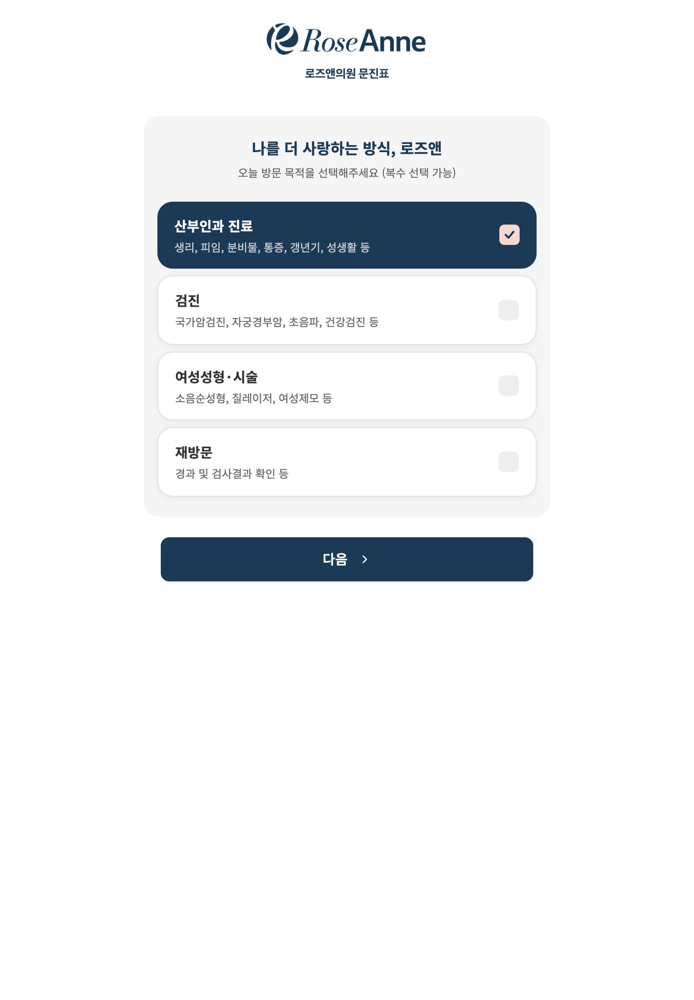
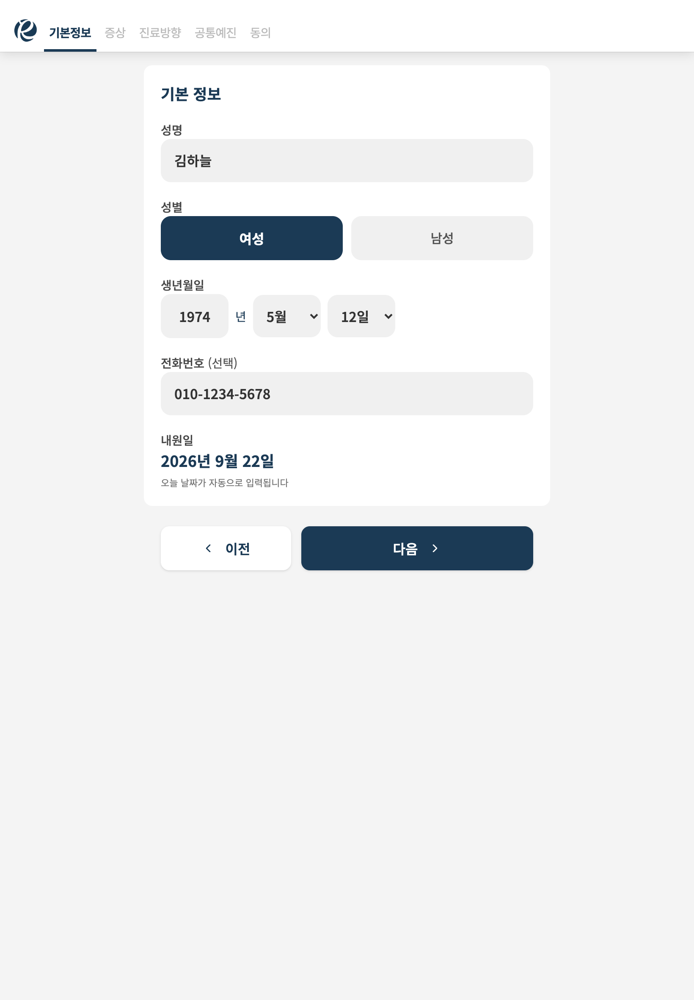
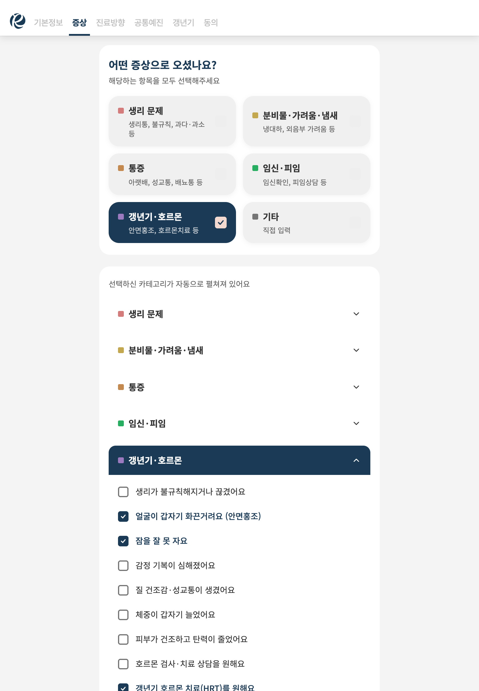
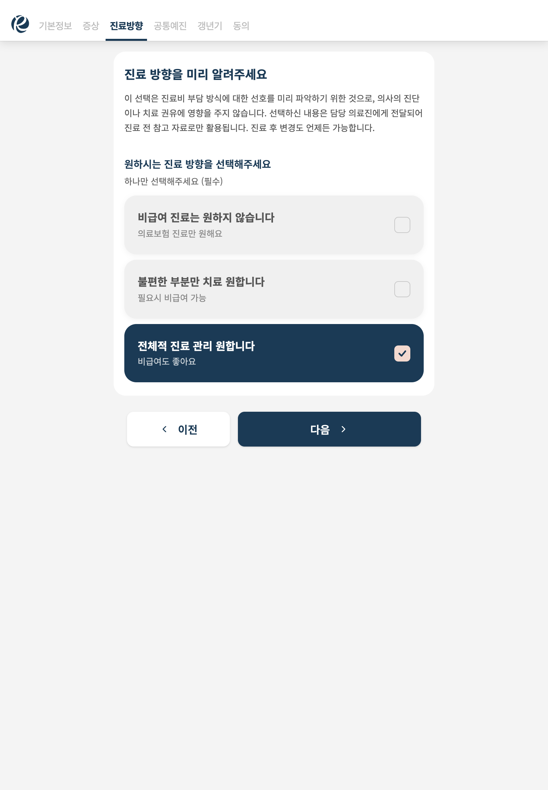
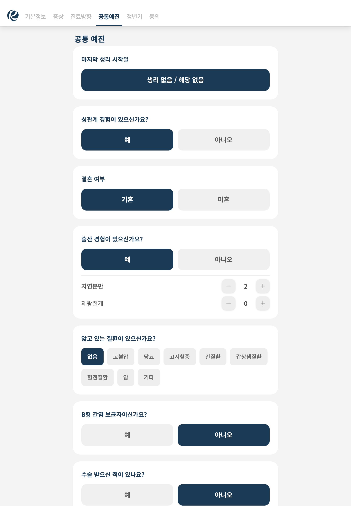
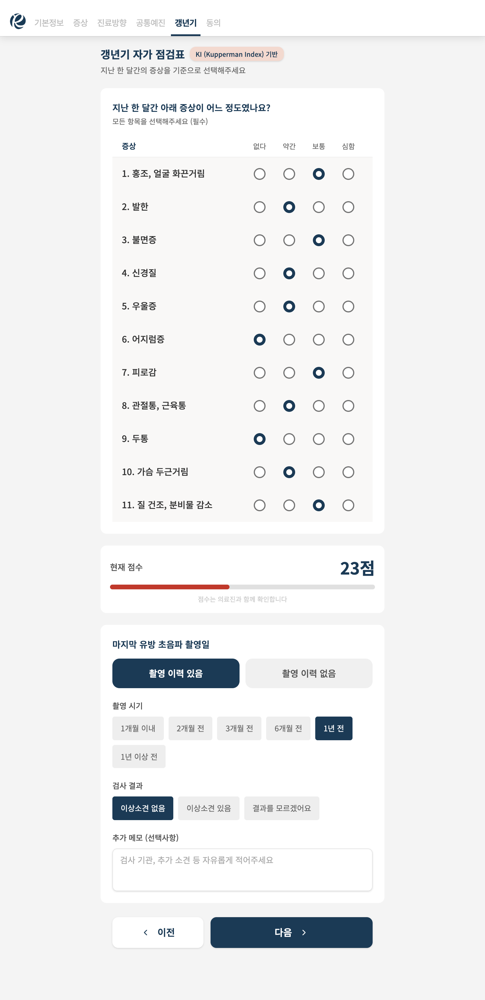
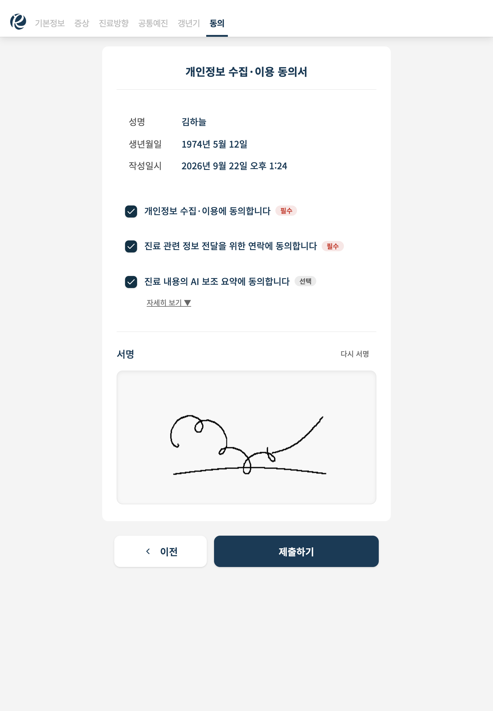
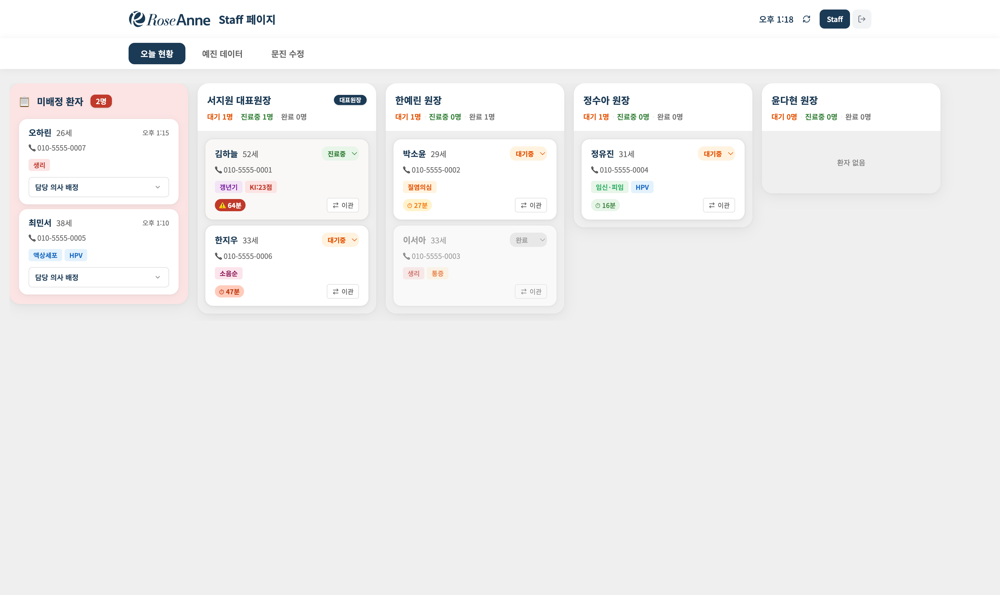
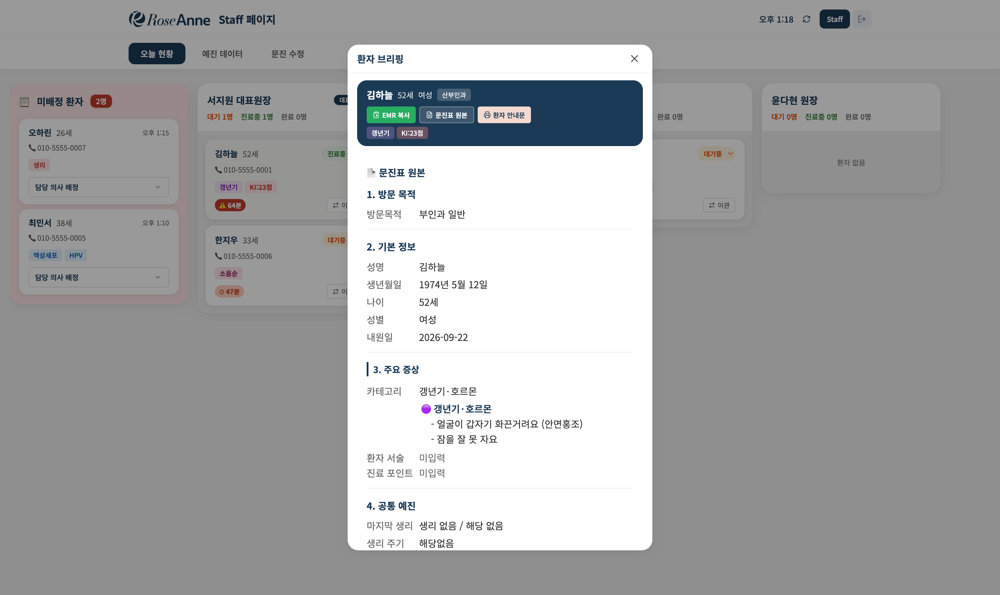
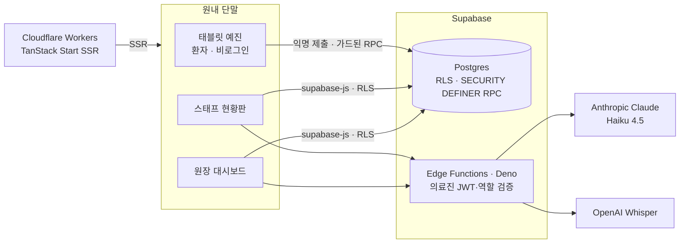

  

<h1 align="center">로즈앤 어시스트</h1>

  <b>산부인과 의원을 위한 태블릿 예진 + AI 진료 어시스트</b> 
  RoseAnne Assist — tablet intake &amp; AI-assisted clinical dashboard for a women's clinic

  
  
  
  
  
  
  

---

실제 의원(**로즈앤의원**)에서 쓰기 위해 기획부터 브랜딩·UI 디자인·개발까지 직접 진행한 서비스입니다. 환자는 대기 중 태블릿으로 예진을 작성하고, 스태프는 현황판에서 원장에게 배정하며, 원장은 AI가 정리한 브리핑을 보고 진료한 뒤 환자가 이해할 수 있는 안내문을 드립니다.

> 🔒 **소스 코드는 비공개입니다.** 실제 의료기관에 도입하는 시스템이라 보안상 코드를 공개하지 않고, 이 저장소에서 문제 정의·설계·핵심 구현을 소개합니다. 핵심 로직은 [기술 구현 문서](docs/technical-highlights.md)에 코드 발췌로 담았습니다.
>
> 스크린샷의 환자는 모두 가상 인물이며, 의료진 이름은 가명으로 처리했습니다.

## 프로젝트 개요

| | |
| --- | --- |
| **기간** | 2026.03 ~ (원내 도입 테스트 중) |
| **역할** | 기획 · 브랜딩/UI 디자인 · 개발 |
| **개발 방식** | Lovable(UI·레이아웃) + Claude Code(구조·로직·리팩터링)로 역할을 나눈 AI 협업 개발 |
| **규모** | 커밋 400+ · TypeScript 약 1.7만 줄 · DB 마이그레이션 17개 · 엣지 함수 5개 · 개발 로그 130여 건 |
| **사용자** | 환자(태블릿·비로그인) · 스태프 · 원장 · 마스터 관리자 |

## 왜 만들었나

| 문제 | 해결 |
| --- | --- |
| 종이 문진표는 판독·입력에 시간이 들고 누락이 잦다 | **태블릿 디지털 예진** — 방문 목적에 따라 문항이 분기 |
| 짧은 진료 시간에 문진 내용을 다 파악하기 어렵다 | **AI 브리핑·SOAP 요약** |
| 대기 현황·배정 상태가 한눈에 안 보인다 | **칸반 현황판** + 접수 경과시간 긴급도 |
| 진료 기록 정리(SOAP·EMR 입력)가 부담이다 | **음성 녹음 → 자동 요약**, EMR 복사 |
| 환자가 진료 내용을 이해하지 못한 채 귀가한다 | **쉬운 말 안내문** — 의사 확정 후 인쇄 |

## 주요 화면

### 환자 — 태블릿 예진

방문 목적(산부인과·검진·여성성형·재방문, 복수 선택)에 따라 단계가 달라집니다. 아래는 갱년기 증상으로 방문한 가상 환자의 흐름입니다.

<table>
  <tr>
    <td align="center" valign="top" width="25%"> ① 방문 목적</td>
    <td align="center" valign="top" width="25%"> ② 기본 정보</td>
    <td align="center" valign="top" width="25%"> ③ 증상 — 선택한 카테고리가 자동으로 펼쳐짐</td>
    <td align="center" valign="top" width="25%"> ④ 진료 방향</td>
  </tr>
  <tr>
    <td align="center" valign="top"> ⑤ 공통 예진</td>
    <td align="center" valign="top"> ⑥ 갱년기 자가점검 — KI 가중치로 점수 산출</td>
    <td align="center" valign="top"> ⑦ 개인정보·AI 요약 동의 + 전자 서명</td>
    <td></td>
  </tr>
</table>

- 태블릿 세로 화면 기준, 상단 탭으로 진행 단계 표시, 스와이프로 이동
- 미성년자는 보호자 정보를 받되 프라이버시 사유의 건너뛰기 허용
- **AI 요약 동의는 별도 항목** — 동의하지 않으면 진료 녹음 기능이 막힘
- WCAG 2.1 AA 기준으로 텍스트 대비·키보드 조작·선택지 ARIA 개선

### 스태프 — 오늘 현황판

- **미배정 | 원장별 가로 칸반** — 박스마다 생기던 중첩 스크롤을 없앰
- **접수 후 경과시간 배지** — 10분 단위로 색이 짙어지고 60분 이상은 긴급(⚠️). 오래 기다린 환자가 바로 보임
- 카드 정렬은 진료중 → 대기중 → 완료, 상태는 태그를 눌러 변경, 원장 간 이관 지원
- 방문 목적·증상을 **태그**로 요약 (갱년기 KI 점수, 검진 항목, 희망 시술 등)

### 환자 브리핑

- 문진표 원본을 진료용으로 재구성, **EMR 복사**(병원 EMR에 붙여넣을 형식)
- 원장 화면에서는 **AI 브리핑·SOAP 요약**, 진료 메모(자동 저장), 음성 녹음 요약까지
- **환자 안내문** — AI 초안 → 의사 확인·수정 → 확정본만 인쇄

## 아키텍처

- **권한은 DB에서 강제** — 모든 테이블 RLS. 비로그인 환자는 *방금 만든 미배정 방문*에만 쓸 수 있는 가드를 통과해야 함
- **AI 호출은 엣지 함수 뒤로** — AI API 키는 서버에만, 호출자는 의료진 역할 검증을 거침
- **읽기 모델 한 곳** — 정규화된 테이블을 대시보드·브리핑·태그가 공통으로 쓰는 평탄화 모델로 변환

## 기술 스택

| 영역 | 사용 기술 |
| --- | --- |
| 프런트엔드 | React 19, TypeScript, TanStack Start(SSR) · Router · Query, Tailwind CSS v4, shadcn/ui |
| 백엔드 | Supabase — Postgres 17, Row Level Security, RPC, Edge Functions(Deno) |
| AI | Anthropic Claude Haiku 4.5 (브리핑·SOAP·요약·안내문), OpenAI Whisper (진료 녹음 전사) |
| 인프라·배포 | Cloudflare Workers, Supabase CLI, GitHub Actions |
| 개발 도구 | Lovable, Claude Code, Bun, ESLint, Prettier |

## 핵심 구현

자세한 원인 분석과 코드는 **[기술 구현 문서](docs/technical-highlights.md)** 에 있습니다.

**1. 익명 예진의 "조용한 데이터 유실" 해결**
비로그인 제출 시 RLS가 하위 테이블 쓰기를 막아 동의·증상·예진이 전부 사라지는데, 화면엔 "제출 완료"가 뜨던 결함. *방금 만든 미배정 방문*에만 쓰기를 허용하는 가드 함수와 이를 재검사하는 `SECURITY DEFINER` RPC로 해결하고, 실패를 모아 성공으로 위장하지 않도록 바꿨습니다.

**2. 엣지 함수 인증 계층 — PHI 유출 경로 차단**
AI 엣지 함수 5개 중 4개가 인증 없이 열려 있었고, 2개는 서버 권한으로 진료 메모를 반환하고 있었습니다. 진입부에 의료진 역할 검증을 넣고 *비인증 401 · 익명 401 · 의료진 통과*를 배포 후 실측했습니다.

**3. AI는 초안까지만 — 사람이 확정하는 구조**
환자 안내문은 AI 출력을 저장하지 않고, 의사가 확인·수정한 확정본만 인쇄합니다. 근거가 없으면 초안 생성을 거부하고, 프롬프트에 "입력에 없는 진단·약·수치를 지어내지 않는다"를 명시했습니다. 화면별로 AI의 역할(임상 표기 / 쉬운 말)을 나눴습니다.

**4. 칸반 현황판 + 접수 경과시간 긴급도**
중첩 스크롤을 없앤 가로 칸반, 10분 단위 색 단계와 60분 긴급 표시, 상태 우선 정렬. 10초 주기 갱신으로 별도 타이머 없이 긴급도가 따라 바뀝니다.

**5. 방문유형 오분류 — 읽기 모델에서 과거 데이터까지 복구**
제출 로직이 모든 방문에 빈 검진 행을 저장해 모든 환자가 "검진"으로 분류되던 버그. 원천을 막고, 읽기 모델에서 내용 없는 행을 걸러내 **운영 DB를 건드리지 않고** 이미 쌓인 데이터까지 바로잡았습니다.

**6. 사후 설계 문서화**
설계 없이 빠르게 만든 시스템을 코드·로그로 역공학해 [요구사항 정의서](docs/requirements.md)와 [AI 명세서](docs/ai-spec.md)를 작성했습니다. 배포된 함수를 실측하며 설계 원칙 대비 격차를 정리했고, 그 과정에서 은퇴한 모델 ID로 실패하던 결함을 찾았습니다.

## 문서

| 문서 | 내용 |
| --- | --- |
| [기술 구현 하이라이트](docs/technical-highlights.md) | 문제 → 원인 → 해결 → 검증, 코드 발췌 |
| [요구사항 정의서](docs/requirements.md) | 기능·비기능 요구사항과 항목별 구현 상태 |
| [AI 명세서](docs/ai-spec.md) | AI 5개 파이프라인 명세, 안전장치, 설계 원칙 격차표 |

## 다음 단계

- **원내 지식 RAG** — 임직원 상담 지원과 고객 응대에 쓸 원내 지식 검색 (온프레미스 구성 검토 중)
- **카카오톡 채널 연동** — 가장 많은 문의 창구인 예약·서류·진료 가능 여부 응대 자동화
- **EMR 연계** — 병원 EMR과 환자 매칭·차트번호 연동

---

이 저장소의 문서·이미지는 포트폴리오 열람용입니다. 무단 복제·재사용을 금합니다.
